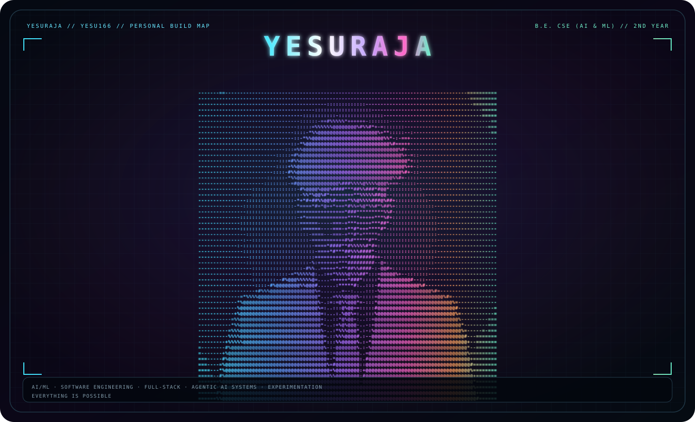
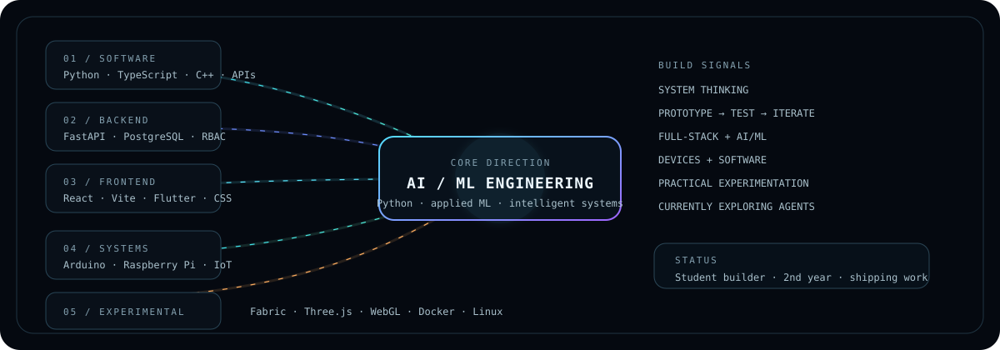
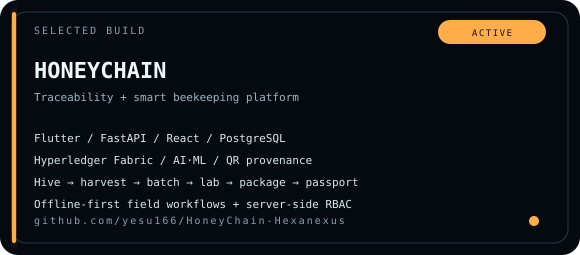
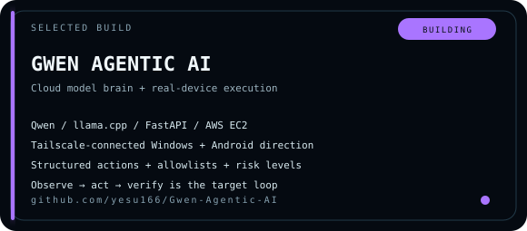
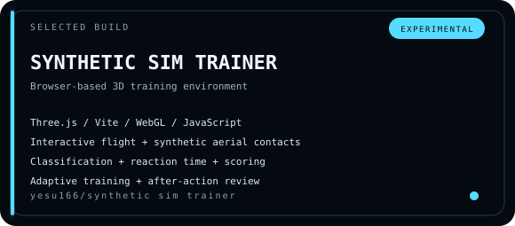

<div align="center">



### YESURAJA

**`yesu166` · B.E. Computer Science & Engineering (AI & ML) · 2nd Year**

*I build things to understand how they work — then keep iterating until they work better.*

[HoneyChain](https://github.com/yesu166/HoneyChain-Hexanexus) · [Gwen Agentic AI](https://github.com/yesu166/Gwen-Agentic-AI) · [Synthetic Simulator](https://github.com/yesu166/Synthetic-Threat-Simulation-Trainer)

</div>

---

## ABOUT

I am a second-year engineering student focused on **AI/ML and software engineering**, with a habit of crossing the boundary into hardware, systems and experimentation.

I learn by building: full-stack applications, applied ML workflows, developer tooling, 3D simulations and connected-device ideas. I care about clear architecture, useful interfaces and knowing the difference between a prototype and a finished system.

---

## ENGINEERING FOCUS

| CORE | WORKING | EXPERIMENTAL |
|---|---|---|
| **AI / ML** | React · TypeScript | Hyperledger Fabric |
| **Python** | FastAPI · REST | Three.js · WebGL |
| **Software Engineering** | PostgreSQL · Flutter | Arduino · Raspberry Pi |
| **Full-Stack Systems** | Git · GitHub | Docker · Linux |



---

## SELECTED BUILDS

<table>
<tr>
<td width="50%" valign="top">

<a href="https://github.com/yesu166/HoneyChain-Hexanexus"></a>

**Status:** Active build  
A full-stack traceability and smart-beekeeping platform linking field records, batch workflows, lab verification, provenance, QR-based consumer verification and AI/ML services.

**Stack:** Flutter · FastAPI · React · TypeScript · PostgreSQL/Supabase · Hyperledger Fabric · Python ML

[Inspect repository →](https://github.com/yesu166/HoneyChain-Hexanexus)

</td>
<td width="50%" valign="top">

<a href="https://github.com/yesu166/Gwen-Agentic-AI"></a>

**Status:** Building / experimental  
An agentic AI project built around a cloud-hosted model brain, structured tools and a secure path toward controlling real Windows and Android devices.

**Stack:** Python · FastAPI · Qwen · llama.cpp · AWS EC2 · Tailscale

[Inspect repository →](https://github.com/yesu166/Gwen-Agentic-AI)

</td>
</tr>
<tr>
<td colspan="2" valign="top">

<a href="https://github.com/yesu166/Synthetic-Threat-Simulation-Trainer"></a>

**Status:** Experimental  
A browser-based 3D simulation environment for synthetic aerial-contact training, explicit classification, reaction-time measurement, scoring, adaptive scenarios and after-action review.

**Stack:** JavaScript · Three.js · Vite · WebGL

[Inspect repository →](https://github.com/yesu166/Synthetic-Threat-Simulation-Trainer)

</td>
</tr>
</table>

---

## CURRENTLY BUILDING

```text
01  AI agents that can observe → act → verify
02  Better production patterns for full-stack systems
03  Applied ML, computer vision and intelligent interfaces
04  Hardware + software experiments that solve something real
```

---

## HOW I ENGINEER

> **Build the smallest useful system.**  
> **Make the architecture understandable.**  
> **Test what matters.**  
> **Document what actually exists.**  
> **Keep prototypes honest about their limits.**

---

## TOOLBOX

**Languages**  
`Python` · `C++` · `TypeScript` · `JavaScript` · `Dart` · `Java`

**AI / ML**  
`scikit-learn` · applied ML · classification · data preprocessing · AI integrations

**Web / Mobile**  
`React` · `Vite` · `Flutter` · `HTML` · `CSS` · `REST APIs`

**Backend / Data**  
`FastAPI` · `PostgreSQL` · `Supabase` · authentication · RBAC · data modeling

**Systems / Experimental**  
`Hyperledger Fabric` · `Three.js` · `WebGL` · `Arduino` · `ESP8266` · `Raspberry Pi` · `Docker` · `Linux`

---

## A SMALL MAP OF THE WORK

```text
                    AI / ML
                       │
             ┌─────────┴─────────┐
             │                   │
        SOFTWARE             SYSTEMS
             │                   │
      Web · Mobile          Devices · IoT
             │                   │
             └─────────┬─────────┘
                       │
                Real Projects
                       │
          ┌────────────┼────────────┐
          ▼            ▼            ▼
      HoneyChain      Gwen      3D Simulator
```

---

## CONNECT

[GitHub](https://github.com/yesu166)

The repositories are the detailed version of the résumé. Start with the selected builds above and inspect the implementation, not just the screenshots.

<div align="center">

---

**Built with curiosity. Improved through iteration.**

</div>
