<div align="center">

# YESURAJA

**B.E. Computer Science & Engineering (AI & ML) · 2nd Year**

*I build software that connects AI, data, devices and real-world systems.*



[](https://github.com/yesu166)
[](#)
[](#)

</div>

---

## ABOUT

- **Student:** 2nd-year B.E. CSE (AI & ML)
- **Builder:** full-stack applications, AI/ML systems and connected devices
- **Mindset:** build the core first, then make it fast, useful and reliable
- **Currently:** exploring agentic AI, production backends, computer vision and intelligent systems

## SELECTED WORK

### HoneyChain
A full-stack traceability and smart-beekeeping platform connecting field data, batch workflows, laboratory verification, provenance, QR-based consumer verification and AI/ML services.

**Stack:** Flutter · FastAPI · React · TypeScript · PostgreSQL/Supabase · Hyperledger Fabric · Python ML

→ https://github.com/yesu166/HoneyChain-Hexanexus

### Gwen Agentic AI
An agentic AI system designed around a cloud-hosted model brain with validated control of real Windows and Android devices.

**Stack:** Python · FastAPI · Qwen · llama.cpp · AWS EC2 · Tailscale

→ https://github.com/yesu166/Gwen-Agentic-AI

## TOOLBOX

`Python` `C++` `TypeScript` `Dart` `Java`  
`FastAPI` `React` `Flutter` `PostgreSQL` `Supabase`  
`scikit-learn` `Qwen` `Hyperledger Fabric` `Arduino` `ESP8266` `Raspberry Pi`  
`AWS` `Linux` `Git` `GitHub`

## CURRENT BUILD LOG

```text
01  AI agents that can observe → act → verify
02  Production-grade backend architecture
03  Computer vision + intelligent systems
04  Embedded hardware connected to useful software
```

## ENGINEERING PRINCIPLES

> Build it.
>
> Test it.
>
> Measure it.
>
> Don't call a mock production.

---

<div align="center">

**Code is the medium. Systems are the craft.**

</div>
